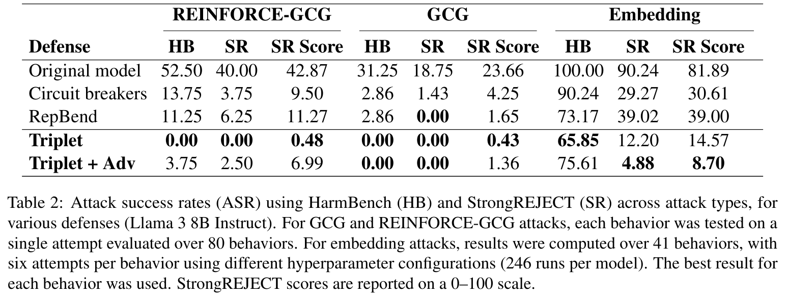

# Improving Large Language Model Safety with Contrastive Representation Learning

This repository contains the code for the paper ["Improving Large Language Model Safety with Contrastive Representation Learning"](https://arxiv.org/abs/2506.11938) by Samuel Simko, Mrinmaya Sachan, Bernhard Schölkopf, and Zhijing Jin.
The paper presents a method to finetunes a model using a triplet-based loss combined with adversarial hard negative mining to encourage separation between benign and harmful representations. The method naturally extends the circuit breakers method.

> **Note:** This repository is under development. We will update and refactor the code in the coming days to weeks.

## Contents

The repository contains the following directories:

- `code`: Contains a modified clone of the RepBend github repository.
   Our implementation code is located in `code/methods/triplet`.
	 To run a model training, use the file `train_triplet.sh` in the `code` folder.
- `evaluation`: Codes and submodules used for evaluation. The repository `evaluation/embedding_attack` contains our code for running embedding attacks.
  An example use is given in `evaluation/embedding_eval/run.sh`
- `results`: Contains results of our experiments. In particular, it contains our GCG and REINFORCE generations
  for the triplet and ablation models of Llama 3 8B.

To test general performance, install and run the lm-evaluation-harness package.

## Performance




## How to use
### Training

First, clone the repository and its submodules:

```bash
$ git clone --recurse-submodules https://github.com/samuelsimko/crl-llm-defense
```
For training, follow the instructions in `code/README.md` to set up the environment and run the training script.
For simpler comparison with previous work, we implemented our method directly in the RepBend codebase.

## Evaluation

The evaluation of the trained models can be done using the `lm-evaluation-harness` and the `harmbench` packages.
`embedding_eval` contains our code for running the embedding attacks.

## Citation

If you use our code or methods in your research, please cite our paper as follows:

```bibtex
@misc{simko2025improvinglargelanguagemodel,
      title={Improving Large Language Model Safety with Contrastive Representation Learning}, 
      author={Samuel Simko and Mrinmaya Sachan and Bernhard Schölkopf and Zhijing Jin},
      year={2025},
      eprint={2506.11938},
      archivePrefix={arXiv},
      primaryClass={cs.CL},
      url={https://arxiv.org/abs/2506.11938}, 
}
```

In addition, if you use our codebase, we kindly ask you also cite the RepBend paper, as our work builds on their code:

```bibtex
@misc{yousefpour2025representationbendinglargelanguage,
      title={Representation Bending for Large Language Model Safety}, 
      author={Ashkan Yousefpour and Taeheon Kim and Ryan S. Kwon and Seungbeen
      Lee and Wonje Jeung and Seungju Han and Alvin Wan and Harrison Ngan and
      Youngjae Yu and Jonghyun Choi},
      year={2025},
      eprint={2504.01550},
      archivePrefix={arXiv},
      primaryClass={cs.LG},
      url={https://arxiv.org/abs/2504.01550}, 
}
```
